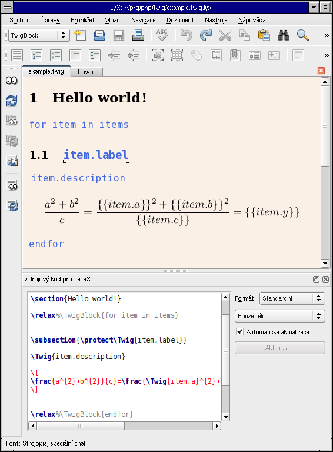
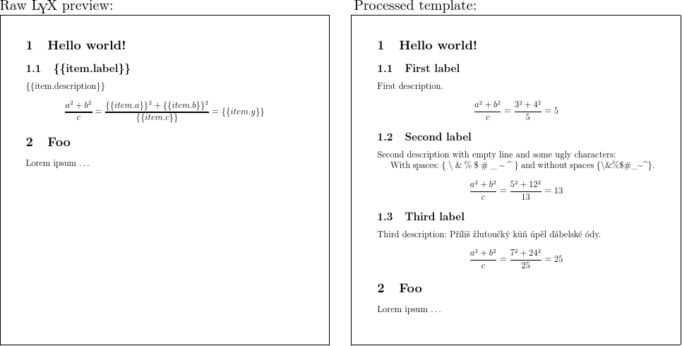

LyX on Twig
===========

LyX-on-Twig is a simple PHP library combining LyX and Twig to create beautiful
generated documents in LaTeX. User/programmer creates template in LyX using
Twig constructs, this template is compiled to LaTeX source code with Twig
constructs, and finally LaTeX template is populated with data, replacing Twig
constructs in the process.

Example
-------

| While editing in LyX:                   |
|:---------------------------------------:|
|     |

&nbsp;

| Preview PDF generated directly from LyX (left) and final document (right): |
|:--------------------------------------------------------------------------:|
|                                                |


Features
--------

  - Use LyX, a graphical WYSIWYM editor, to create template.
  - Use Twig to populate the template with data.
  - Everything in simple and easy-to-use package.

Requirements
------------

  - Texlive installed on server.
  - LyX installed on developper's computer.
  - Optional: LyX on server if templates should be compiled from LyX to LaTeX
    on server.


Usage
-----

  1. Create LyX document using `lyx/twig.article.layout` as a layout file. You may want to symlink this file next to your document.
  2. Use LyX to export tex template: `lyx -batch -e pdf5 template.twig.lyx`.
  3. Compile the template `template.twig.tex` to PDF:

      ```
      $lyxtwig = new LyxOnTwig('./', array('cache' => './cache/'));
      $output_file = tempnam(tempnam(sys_get_temp_dir(), 'output.');
      if ($lyxtwig->render('template.twig.tex', 'template.twig.pdf', array('some' => 'data'))) {
          // Do something with PDF in $output_file
      }
      ```

PDF Properties
--------------

Fortunately LyX does not escape PDF options (in document settings, PDF
properties), so it is possible to use `\noexpand\Twig{expression}` to insert
`expression` into PDF title or any other field. The `\noexpand` is required to
stop LaTeX from expanding the `\Twig` macro which is not defined yet.


License
-------

The most of the code is published under Apache 2.0 license. See
[LICENSE](doc/license.md) file for details.


Contribution guidelines
-----------------------

If you wish to send me a patch, please create a Git pull request or send a Git
formatted patch via email.
